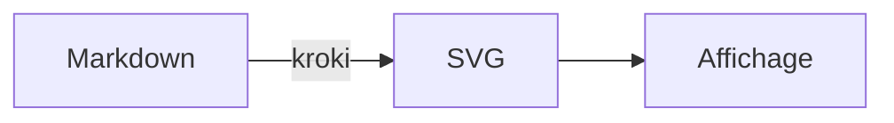
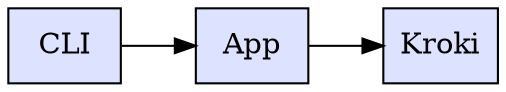

# Test diagrammes


```mermaid
graph LR; A[Markdown] -->|kroki| B[SVG]; B --> C[Affichage];
```


```dot
digraph G { rankdir=LR; node [shape=box style=filled fillcolor="#dde3ff"]; CLI -> App -> Kroki; }
```

```svgbob
 .---.    .---.
 | A +--->+ B |
 '---'    '---'
```
